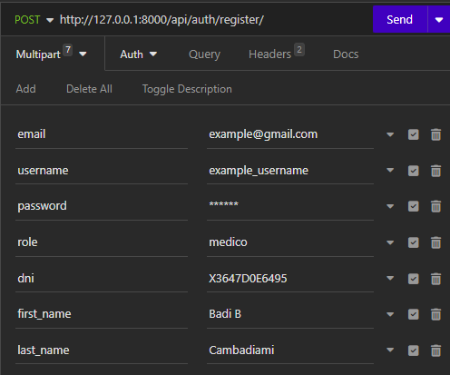

# URO APP

## Descripción
URO APP es una herramienta móvil basada en Inteligencia Artificial que brinda soporte en la toma de decisiones relacionadas con el tratamiento del cáncer de vejiga.

## Requisitos
Antes de poner en marcha la aplicación, asegúrate de tener las siguientes aplicaciones y componentes instalados:

#### Lenguaje de programación
- [Python 3](https://www.python.org/downloads/)

#### Entorno virtual de Python (virtualenv)
- Para instalar virtualenv, ejecuta el siguiente comando en tu terminal:
  - `pip install virtualenv` o `pip3 install virtualenv`

#### Servidor de base de datos
Puedes elegir uno de los siguientes servidores de base de datos para utilizar:
- [WampServer](https://www.wampserver.com/en/download-wampserver-64bits/)
- [XAMPP](https://www.apachefriends.org/es/download.html)

#### Plataforma API para probar los endpoints
Para probar los endpoints de la aplicación, puedes utilizar cualquiera de las siguientes plataformas:
- [Postman](https://www.postman.com/downloads/)
- [Insomnia](https://insomnia.rest/download)

## Configuración de la Base de Datos
Una vez instalados los requisitos anteriores, sigue estos pasos para configurar la base de datos:

1. Crea una base de datos con el nombre: *`uro_bd_v1`* en tu servidor de base de datos MySQL.

2. Abre el archivo de configuración de la conexión a la base de datos ubicado en *`uro_api/backend/backend/settings.py`*.

3. En la sección `DATABASES`, configura las siguientes variables con tus credenciales para acceder a la base de datos local que creaste previamente. Por ejemplo:

   ```python
   DATABASES = {
       'default': {
           'ENGINE': 'django.db.backends.mysql',
           'NAME': 'uro_bd_v1',
           'USER': 'nombre de usuario para acceder a la base de datos',
           'PASSWORD': 'password para acceder a la base de datos',
           'HOST': 'localhost',
           'PORT': 'el puerto donde está corriendo el servidor de la base de datos',
           'OPTIONS': {
               'charset': 'utf8',
           },
       }
   }
   ```

## Instalación de Módulos y Librerías de Python
Continúa con la instalación de los módulos y librerías necesarios para el proyecto:

1. Crea y activa un entorno virtual para evitar conflictos con otras aplicaciones de Python en tu máquina. Ejecuta los siguientes comandos en tu terminal:

   - `virtualenv venv` para crear el entorno virtual.
   - `source venv/Scripts/activate` para activar el entorno virtual.

2. En la terminal de comandos, navega al directorio *`uro_api/backend`* y ejecuta el siguiente comando para instalar las bibliotecas requeridas:

   - `pip install -r requirements.txt`

3. Asegúrate de que todo se configure correctamente hasta este punto para evitar problemas futuros.

## Migración de la Base de Datos
Realiza las migraciones necesarias en la base de datos:

1. Ejecuta los siguientes comandos desde el mismo directorio donde te encuentras:

   - `python manage.py makemigrations` para crear las migraciones.
   - `python manage.py migrate` para aplicar las migraciones a la base de datos.

2. Si surge un error relacionado con el tamaño de los campos asignados en el modelo de datos para las tablas *user*, *bladdercancer*, y *bladdercancerprediction*, ejecuta el siguiente comando en tu servidor local:

   - `ALTER DATABASE databasename CHARACTER SET utf8;`

3. Luego, vuelve a ejecutar `makemigrations` y `migrate`.

## Importación de Datos Iniciales
Procede con la importación de los datos iniciales en la tabla `bladdercancerprediction`. Puedes encontrar el script adjunto en la misma carpeta del proyecto.

## Iniciar la Aplicación
Ahora, la aplicación está lista para ser ejecutada. Utiliza el siguiente comando para iniciarla:

- `python manage.py runserver`

## Endpoints
Para explorar los endpoints disponibles en la aplicación, abre un navegador y accede a las siguientes rutas:

- [Documentación Swagger](http://localhost:8000/docs)
- [Documentación ReDoc](http://localhost:8000/redocs)

Estas rutas proporcionan información detallada sobre los endpoints, los parámetros y las respuestas disponibles.

## Registro de Médico
Antes de comenzar a utilizar los endpoints, debes registrarte como médico en la aplicación. Utiliza el siguiente endpoint:

- `http://localhost:8000/auth/register/`

Este endpoint es una solicitud de tipo POST, por lo que debes enviar los datos como se muestra en la imagen a continuación:

